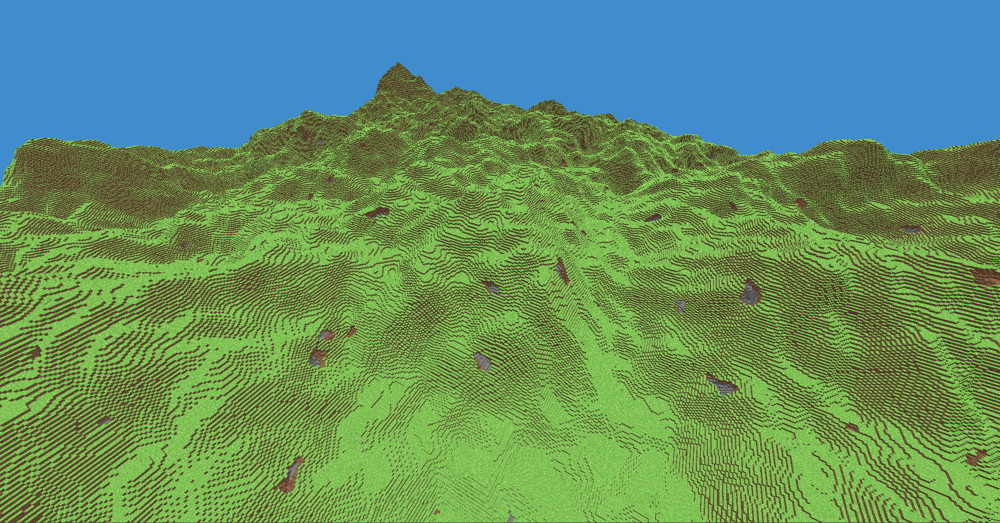
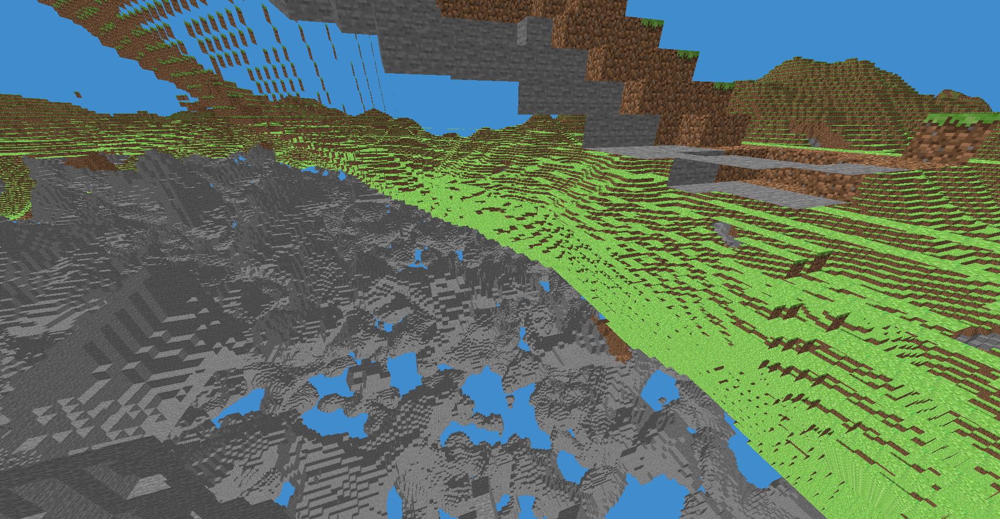

# BlockGame - Voxel World Generation Prototype

BlockGame is a low-level, high-performance 3D voxel world generation engine written in pure C using modern OpenGL. Inspired by games like Minecraft, this project focuses on algorithmic world generation, efficient chunk management, and real-time 3D rendering optimized for (low-level) memory handling.

---

## Media & Demos

### World Generation Showcase


*Infinite landscape generation featuring chunk-based rendering and basic lighting.*

### Fly-through Video
[](https://youtu.be/_VJAnsOUaWU)
*Click the badge above to watch the world rendering and chunk loading in real-time.*

---

## Technical Features & Architecture

* **Procedural Terrain Generation:** Implements noise algorithms (e.g., Perlin/Simplex noise) to generate natural-looking hills, valleys, and biomes.
* **Efficient Chunk Management:** The world is divided into manageable $16 \times 16 \times 16$ chunks.
* **Voxel Rendering Optimization:** Utilizing OpenGL Vertex Buffer Objects (VBOs) and Vertex Array Objects (VAOs). Features face-culling optimization (only rendering block faces that are visible to the air) to significantly reduce draw calls.
* **Pure C Implementation:** Manual memory management and custom data structures designed for maximum speed and minimal memory footprint.

---

## Tech Stack & Dependencies

* **Language:** Pure C
* **Graphics API:** OpenGL
* **Windowing & Input:** GLFW
* **OpenGL Extension Loader:** GLEW
* **Math Library:** cglm

---

## Building and Running

### Prerequisites
Make sure you have a C compiler (GCC, Clang, or MSVC) and GLFW, GLEW development libraries installed on your system.

```bash
# Clone the repository
git clone https://github.com/veresdomonkos/BlockGame.git
cd BlockGame